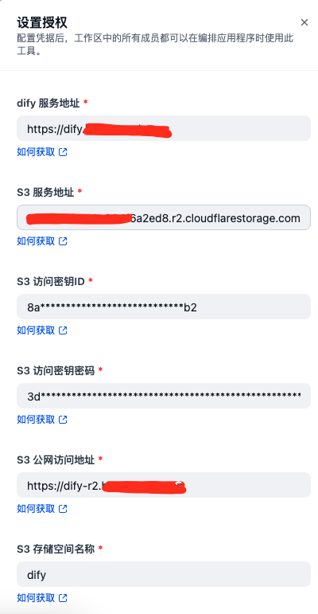

# botos3

**Author:** datoujiejie
**Version:** 0.0.1
**Type:** tool

# Description

## Overview

`botos3` is a dify plugin tool designed to streamline the process of uploading files to S3-compatible object storage services using the powerful `boto` library. Beyond just storage, this tool automatically generates and returns publicly accessible URLs for uploaded files, making it ideal for sharing and integrating with other systems.

This tool allows developers and teams to simplify file management workflows, ensuring efficient and secure interactions with S3 buckets.

## Features

1. Convenient file upload to S3-compatible object storage.
2. Automatic generation of public URLs for uploaded files.
3. Supports both file-based and base64-encoded uploads.

## Setup

## Available Tools

### 1. `s3_upload_file`

**Description:** Uploads a specified file to the configured S3 bucket and returns the public URL for the uploaded file.
**Parameters:**

- **File:** The file from dify.
- **File_URL:**  The file url.
- **S3 key:** The key (destination path) for the file in the S3 bucket. (required)

### 2. `s3_upload_base64`

**Description:** Uploads a base64-encoded object to the configured S3 bucket and returns its public URL. 
If base64 comes from the sandbox, you have to adjust the value of CODE_MAX_STRING_LENGTH 
**Parameters:**

- **Base64 string:** The content in base64 format to be uploaded.
- **S3 key:** The key (destination path) for the object in the S3 bucket.

## Author

Created by [datoujiejie](https://github.com/datoujiejie)

## Repository

https://github.com/datoujiejie/botos3
